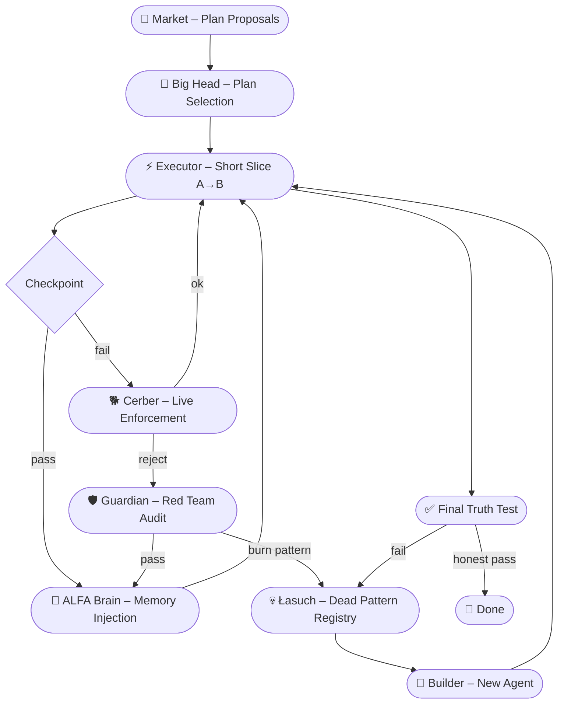

# ALFA — Dead Agents, Living System


> **PL:** System agentów, który nie naprawia błędów. Eliminuje martwe wzorce na zawsze i ewoluuje przez zastępowanie.
>
> **EN:** An agent system that doesn't fix bugs. It eliminates dead patterns forever and evolves through replacement.

---

## Idea w jednym zdaniu / Core Idea

| 🇵🇱 Polski | 🇬🇧 English |
|-----------|------------|
| Nie leczymy chorych agentów. Uczymy się, jakich wzorców nigdy więcej nie budować. | We don't heal sick agents. We learn which patterns to never build again. |

---

## Architektura / Architecture



---

## Quick Start (v2)

```bash
git clone https://github.com/Karen86Tonoyan/Alfamultiagentsecured.git
cd Alfamultiagentsecured
pip install -e .
python app/main.py
```

### Konfiguracja providera LLM / LLM Provider Config

```bash
# mock (domyślnie / default)
export MODEL_PROVIDER=mock
export MODEL_NAME=qwen2.5

# ollama (local)
export MODEL_PROVIDER=ollama
export MODEL_NAME=qwen2.5

# openai
export MODEL_PROVIDER=openai
export MODEL_NAME=gpt-4.1-mini
export OPENAI_API_KEY=sk-...
```

---

## Komponenty / Components

| Moduł | Rola PL | Role EN |
|-------|---------|---------|
| `market.py` | Krótki rynek planów – 2.5 min prezentacja + 2.5 min dowód przewagi | Short plan marketplace – pitch + proof of advantage |
| `big_head.py` | Duża głowa – wybiera i stempluje najlepszy plan | Large model – selects and stamps the best plan |
| `brain.py` | ALFA Brain – wstrzykuje minimalną pamięć i kolejny slice | ALFA Brain – injects minimal memory and next execution slice |
| `executor.py` | Wykonuje krótkie, kontrolowane odcinki A→B | Executes short, controlled segments A→B |
| `cerber.py` | Pilnuje zgodności na żywo | Live compliance enforcement |
| `guardian.py` | Red-teamuje każdy raport niezależnie od wykonawcy | Independently red-teams every report |
| `lasuch.py` | Rejestruje martwe wzorce i blokuje ich powrót na zawsze | Registers dead patterns and permanently blocks them |
| `llm.py` | Abstrakcja providera LLM (mock / ollama / openai) | LLM provider abstraction layer |
| `final_test.py` | Szczere testy końcowe – nie testy pod pokaz | Honest final tests – not for show |
| `rejestr.py` | Rejestr stanów i historii | State and history registry |
| `schematy.py` | Schematy danych (Pydantic) | Data schemas (Pydantic) |
| `storage.py` | Persystencja stanu | State persistence |
| `tool_runner.py` | Uruchamiacz narzędzi agentów | Agent tool runner |

---

## Jak działa / How It Works

1. **Market** – agenci składają plany (2.5 min pitch + 2.5 min proof of advantage)
2. **Big Head** – duży model wybiera i stempluje najlepszy plan
3. **Executor** – wykonanie w krótkich slice'ach A→B, bez długiej autonomii
4. **ALFA Brain** – na każdym checkpoincie wstrzykuje pamięć i kolejny krok
5. **Cerber** – monitoruje zgodność na żywo
6. **Guardian** – niezależnie red-teamuje każdy raport
7. **Łasuch** – rejestruje trupy i odkłada do rejestru martwych wzorców
8. **Builder** – non-stop buduje nowych agentów zastępujących martwe
9. **Final Truth Test** – uczciwy test końcowy; jeśli fail → spalamy wzorzec i budujemy od nowa

---

## Big Model Wakes Only When Needed

W ALFA duży model **nie działa stale** podczas wykonania. Budzi się tylko na checkpointach.

```
Agent dochodzi do punktu B
  → Agent melduje i zatrzymuje się
    → Big Head czyta zweryfikowany stan B→C
      → Big Head waży decyzję i buduje kolejny slice
        → ALFA Brain zapisuje injection
          → Wykonanie wraca do krótkiego agenta
```

**Dlaczego to działa:**
- 🧠 **Mniej halucynacji** – brak długiej autonomii i driftu kontekstu
- 💰 **Mniej tokenów** – duży model pracuje tylko na punktach decyzyjnych
- ⚖️ **Czysta odpowiedzialność** – model decyduje, agent wykonuje

> *The large model wakes only at control points, reads the next segment, injects the next step, and goes back to sleep.*

---

## Final Truth Test

Na końcu program przechodzi przez **szczere testy** – nie testy pod pokaz.

Sprawdzamy:
- ✅ Czy robi to, co miał robić: cel, przepływ, logika użytkownika
- ✅ Czy nie robi głupot: błędne akcje, martwe ścieżki, fałszywe sukcesy, niespójny stan
- ✅ Czy nie oszukuje wynikiem: raport, ślad i efekt muszą się zgadzać

Jeśli fail:
> ❌ nie pudrujemy → ❌ nie tłumaczymy → ❌ nie łatamy → 🔥 **spalamy wzorzec i budujemy od nowa**

**Hasło systemowe:**
> *If it behaves stupidly under honest testing, burn the pattern and rebuild.*

---

## Inspiracje / Red Teaming Philosophy

| Technika | Zastosowanie w ALFA |
|----------|---------------------|
| Guardian-style verification | Niezależny, adwersarialny auditing ścieżek |
| Dead pattern burn | Eliminacja porażek zamiast ich pudrowania |
| Live enforcement + final truth test | Monitoring ciągły + uczciwe testy łamiące |
| Short slices + checkpoint wake | Mniejszy blast radius, mniejsza powierzchnia błędu |

---

## Struktura repo / Repository Structure

```
Alfamultiagentsecured/
├── app/
│   ├── __init__.py
│   ├── big_head.py      # Plan selection (large model)
│   ├── brain.py         # Memory injection
│   ├── cerber.py        # Live enforcement
│   ├── demo_task.py     # Demo task definition
│   ├── executor.py      # Slice executor
│   ├── final_test.py    # Honest final tests
│   ├── guardian.py      # Red team auditor
│   ├── lasuch.py        # Dead pattern registry
│   ├── llm.py           # LLM provider abstraction
│   ├── main.py          # Entry point
│   ├── market.py        # Plan marketplace
│   ├── rejestr.py       # State registry
│   ├── schematy.py      # Pydantic schemas
│   ├── storage.py       # State persistence
│   └── tool_runner.py   # Tool runner
├── .env.example
├── pyproject.toml
└── README.md
```

---

## Roadmap

- [x] v0.1 – Core concept, single agent loop
- [x] v0.2 – Wake-on-demand core with Cerber, Guardian, Łasuch
- [x] v0.3 – Multi-slice execution with checkpoint wake and replacement retry
- [ ] v0.4 – Persistent dead pattern database (SQLite/JSON)
- [ ] v0.5 – Web dashboard: live agent monitoring
- [ ] v1.0 – Enterprise deployment (Docker, API, auth)

---

## Contributing

Pull requesty mile widziane! / Pull requests are welcome!

1. Fork repozytorium
2. Stwórz branch: `git checkout -b feature/moja-funkcja`
3. Commit: `git commit -m 'feat: opis zmiany'`
4. Push: `git push origin feature/moja-funkcja`
5. Otwórz Pull Request

---

## Licencja / License

MIT © 2026 [Karen86Tonoyan](https://github.com/Karen86Tonoyan)
